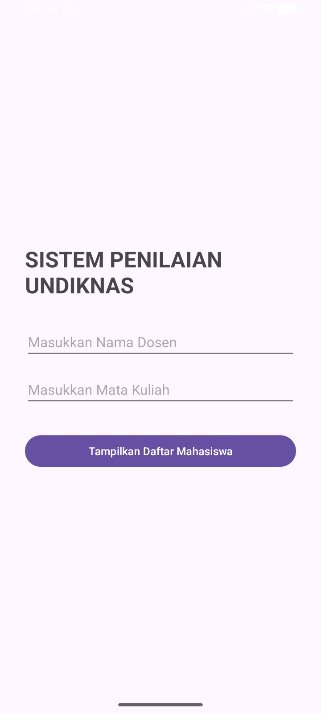
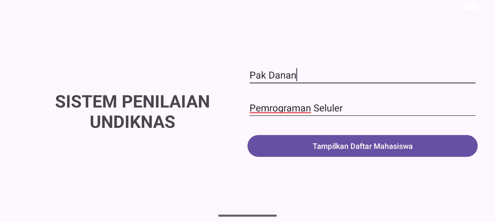
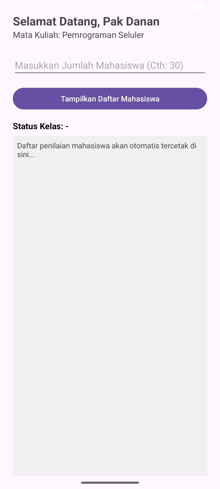
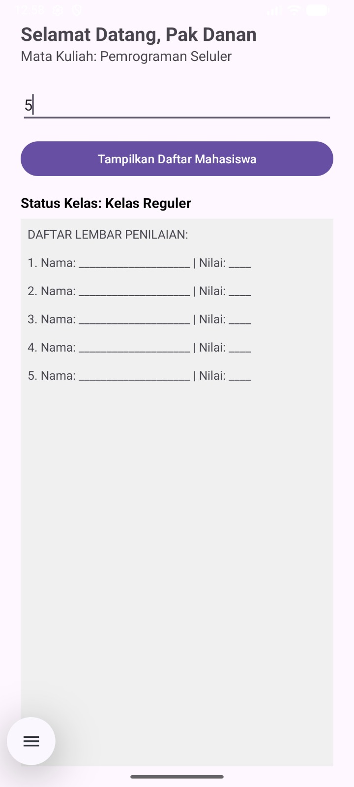

# UTS Pemrograman Seluler - Generator Penilaian

**Nama:** Meizaluna Aurelia Frakasa
**NIM:** 42430045

## Deskripsi Aplikasi
Aplikasi ini adalah sistem generator lembar penilaian mahasiswa yang dibangun menggunakan bahasa Kotlin untuk memenuhi tugas Ujian Tengah Semester. Aplikasi ini mendemonstrasikan pemahaman terkait:
* **Modul 2 & 3:** Penggunaan Layouting (LinearLayout/RelativeLayout) dan adaptasi UI pada orientasi layar Portrait dan Landscape.
* **Modul 4:** Penggunaan Explicit Intent untuk melakukan *data passing* (mengirim Nama Dosen dan Mata Kuliah) antar Activity.
* **Modul 5:** Implementasi logika kontrol aliran (If-Else) untuk menentukan status kelas, serta perulangan (For-Loop) untuk mencetak daftar absensi secara otomatis.

## Dokumentasi Tampilan Aplikasi

### 1. Halaman Login (Portrait & Landscape)

### 2. Halaman Panel Generator (Input & Hasil)

